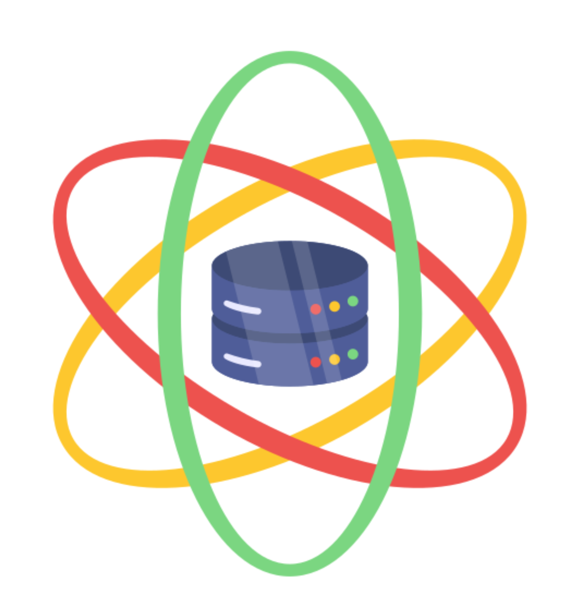
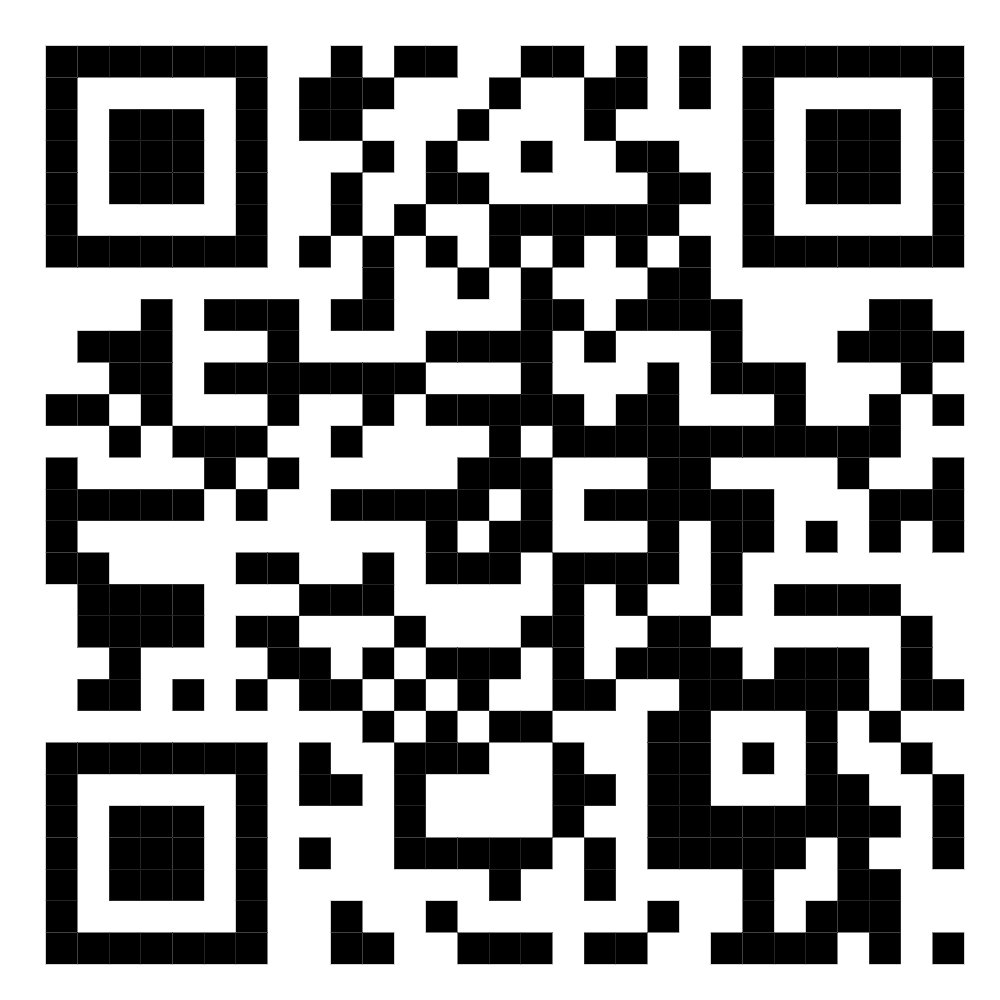

# Welcome to the website of the Data Science Students Team Vienna

{: style="width:150px; 
height:auto; 
border-radius:50%;" }

Last updated: 15.02.2025

## What we are
We meet weekly to collaborate on data science challenges, 
fostering
skill development, teamwork, and practical problem-solving. Learn more about 
these challenges below!

## What you get
💡Learn from others and grow your skills. 

🧩Tackle real-world problems together. 

🎯Build a professional profile. 

## What are data science challenges?
Data science challenges are competitions where individuals or teams tackle 
real-world problems using data analysis, machine learning, and statistical 
techniques. Participants receive datasets and a specific goal—such as predicting
outcomes, identifying patterns, or deriving insights—and work within time 
constraints to develop effective solutions. These challenges not only test 
skills in data preprocessing, model building, and evaluation but also often
offer prize money as a reward. They provide a unique opportunity to apply 
theoretical knowledge, gain experience with real-world data, and grow in the 
field of data science and machine learning. 

## Why should I join a team?
While it’s true that you can tackle data science challenges alone from the 
comfort of your home, joining a team can significantly increase the chances of 
success. With multiple people, each bringing unique skills and perspectives, 
problem-solving becomes more robust and creative. We have the chance to learn
from each other, gaining insights that we might not reach on our own. Plus, 
working as a team makes the process more enjoyable, keeps motivation high, and 
adds a social element that turns challenges into a shared experience. 

## Who can join?

**Anybody can join**, but we recommend that you know how to code in Python and 
know the basics of machine learning (e.g. supervised learning: neural 
networks, tree based methods, etc.). Otherwise, participating in 
challenges can be overwhelming.

Not sure if you’re ready yet? Consider testing the waters with the 
[Titanic Data Science Challenge](https://www.kaggle.com/competitions/titanic)
on Kaggle. It’s a beginner-friendly challenge that runs indefinitely and can be
completed in a few hours.

If you feel you are not quite ready yet, we recommend doing the Coursera course:
[Machine Learning Specialization](https://www.coursera.org/specializations/machine-learning-introduction#courses)
, taught by Andrew Ng.

## Where and when do we meet?
We meet **every Friday from 18:00 to 19:00**. Place will be put here soon.

Before coming, please check our WhatsApp group (see below) to confirm if we 
are actively working on challenges. There may be longer breaks, especially in
the summer.

You might want to bring your laptop and/or something to take notes.

## Links
### **WhatsApp**
Join our WhatsApp group by using this 
[link](https://chat.whatsapp.com/H2vBsdCdU1d2t5eUVjMHia) or scan the QR code below:

{: style="width:200px; 
height:200px;" }

We use WhatsApp for general communication and organizational updates.

### **Discord**
For challenge-specific discussions, join our
[Discord server](https://discord.gg/bpX65Hdm).

### **GitHub**
We store all our code on our
[GitHub organization](https://github.com/Data-Science-Students-Team-Vienna). 
For each
challenge, a repository is created. Branches inside the repo provide the 
personal code storage for each participant. To get added, write an email to  
Thomas Rauter: thomas.rauter@plus.ac.at  
<button onclick="copyEmail()" style="cursor:pointer; padding:5px 10px; background-color:#007BFF; color:white; border:none; border-radius:5px; font-size:14px;">
  Copy Email
</button>

### **Cloud storage**
Coming soon.

### **LinkedIn**
We also have a 
[LinkedIn page](https://www.linkedin.com/groups/10061274/), where we share our 
successes. Feel free to repost any posts about the completion of a challenge you
participated in.

## Any Questions?
Write an email to Thomas Rauter: thomas.rauter@plus.ac.at  
<button onclick="copyEmail()" style="cursor:pointer; padding:5px 10px; background-color:#007BFF; color:white; border:none; border-radius:5px; font-size:14px;">
  Copy Email
</button>

